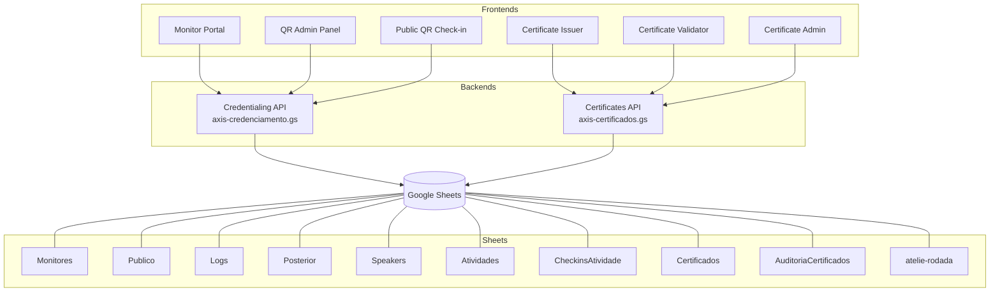

# AXIS Summit Certificate System

> Production credentialing, QR attendance capture, and certificate issuance platform built for a live two-day summit — entirely on Google Apps Script, Google Sheets, and vanilla JavaScript.

## The Problem

AXIS Summit needed a single operational system that could handle live credentialing at peak check-in windows, activity-level QR attendance capture across multiple stages, and post-event certificate issuance — all without manual reconciliation. The event had multiple participation paths (public attendees, speakers, atelier participants, business-round participants), overlapping identity records across data sources, on-site late-registration edge cases, and a hard requirement for fast concurrent responses during check-in surges.

## The Solution

I built a lightweight operations platform with two independent Apps Script backends sharing one Google Sheets datastore, and six vanilla JS frontends — each handling a distinct operational surface.

### Operational Surfaces

| Frontend | File | Purpose |
|----------|------|---------|
| **Monitor Portal** | `web/credentialing/monitores.html` | Operator login, participant search, daily check-in, late registration, live stats dashboard |
| **QR Admin Panel** | `web/qr/admin-qr.html` | Sync schedule → activities, generate per-activity QR codes, export posters, view confirmation counts |
| **Public QR Check-in** | `web/qr/checkin-atividade.html` | Token-validated attendance form scanned from on-site QR posters |
| **Certificate Issuer** | `web/certificates/certificados.html` | Public issuance form with identity confirmation, branded PDF preview, jsPDF export |
| **Certificate Validator** | `web/certificates/certificados-validator-v3.html` | Public lookup by validation code — confirms certificate authenticity |
| **Certificate Admin** | `web/certificates/certificados-admin.html` | Manual participant upsert for speakers and public attendees into the shared data model |

### Backend APIs

| Endpoint | File | Actions |
|----------|------|---------|
| **Credentialing** | `apps-script/axis-credenciamento.gs` | `login`, `buscarParticipantes`, `registrarCheckin`, `cadastrarParticipante`, `sincronizarAtividades`, `validarTokenAtividade`, `confirmarCheckinAtividade`, `obterEstatisticas`, `statsAtividadeLote` |
| **Certificates** | `apps-script/axis-certificados.gs` | `emitirCertificado`, `reemitirCertificado`, `buscarCertificado`, `validarCertificado`, `solicitarAvaliacaoCertificado`, `cadastrarParticipanteManual` |

## Scale & Results

- Used in a real production event, not a demo flow.
- Supported 960+ attendees across a two-day summit.
- Handled on-site monitor operations, same-day edge-case registrations, and post-event certificate requests from a shared data model.
- Reduced manual certificate lookup by turning presence logs into deterministic issuance rules and reusable validation codes.
- Enabled the team to run public attendance capture and credential recovery without introducing a separate backend stack.

## Technical Highlights

- **`LockService` concurrency guards**: every write path (`registrarCheckin`, `confirmarCheckinAtividade`, `emitirCertificado`, `cadastrarParticipanteManual`) acquires a script lock with a 10-second timeout to prevent duplicate writes under concurrent monitor usage.
- **Deterministic certificate keys**: certificate records are keyed by `participant_key + dias_key`, so reissuing the same certificate returns the original validation code instead of creating a duplicate row.
- **HMAC-SHA256 activity tokens**: `buildActivityToken_()` signs each activity ID with a server-side secret via `Utilities.computeHmacSha256Signature`, producing a 40-char hex token embedded in QR URLs. The public check-in page validates the token before accepting attendance.
- **Multi-source participant resolution**: the certificate backend searches `Speakers`, `LogsSpeakers`, `Publico`, `Posterior`, `Prévia CPF`, and `atelie-rodada` sheets with per-sheet column overrides (`SHEET_COL_OVERRIDES`) and multi-variant column matching (`COL_VARIANTS`).
- **Rate limiting via CacheService**: each action type has a per-minute budget (e.g., 10 emissions, 30 validations). Keys are SHA-256 hashes of action + normalized identity fields, stored in `CacheService` with 60-second TTL.
- **CPF validation with check-digit verification**: `normalizeCpf_()` strips non-digits, rejects all-same-digit sequences, and validates both mod-11 check digits before accepting a CPF.
- **Editorial case normalization**: `normalizeEditorialCase_()` applies Portuguese-aware title casing — lowercase prepositions/articles, uppercase acronyms (AXIS, PUCRS, CPF), and segment-boundary capitalization.
- **Honeypot anti-bot protection**: a hidden `_trap` field is sent with every request; the backend rejects any payload where the field is non-empty.
- **Identity step-up confirmation**: when the backend detects ambiguous identity matches, it returns `IDENTITY_CONFIRMATION_REQUIRED` with `requiresCpf: true`, prompting the frontend to collect CPF before re-submitting.
- **Browser-side PDF generation**: `certificados-v3.js` renders a branded certificate preview in HTML, captures it with `html2canvas`, and exports via `jsPDF` with QR embedding, validation deep links, and speaker-specific visual differentiation.
- **Activity sync pipeline**: `sincronizarAtividades_()` transforms schedule data into QR-ready activity records with deterministic IDs (`day__time__stage__title`), and simultaneously upserts the speaker list from mediator/participant fields.

## Stack

- **Backend**: Google Apps Script (two independent deployments, ~3,960 lines total)
- **Datastore**: Google Sheets (10 purpose-specific sheets)
- **Frontend**: Vanilla JavaScript + HTML5 + CSS3 (six pages, shared API client and utility layer)
- **Services**: `LockService`, `CacheService`, `PropertiesService`, `MailApp`/`GmailApp`
- **Libraries**: QRCode.js 1.0.0, jsPDF 2.5.1, html2canvas 1.4.1
- **Fonts**: Google Fonts (Nunito family)
- **Auth**: SHA-256 hashed monitor credentials, HMAC-SHA256 activity tokens, `CERT_SALT` via Script Properties

## Usage

### Prerequisites

1. A Google Sheets spreadsheet — the backends auto-create required sheets on first request.
2. Two Apps Script projects deployed as Web Apps (one for credentialing, one for certificates).

### Configuration

1. In the credentialing project, set `CONFIG.SPREADSHEET_ID` and `CONFIG.TOKEN_SECRET`.
2. In the certificates project, set `CERT_CONFIG.SPREADSHEET_ID` and add `CERT_SALT` as a Script Property.
3. In the frontend files, update the API URLs:
   - `web/shared/axis-api.js` → `CONFIG.API_URL`
   - `web/certificates/certificados-v3.js` → `AXIS_CERT_API_URL`

### Running

Open any of the six HTML pages in a browser. No build step required.

> See [`docs/`](docs/) for detailed documentation on each subsystem: [credentialing](docs/credentialing-system.md), [QR validation](docs/qr-validation.md), [certificate generation](docs/certificate-generation.md).
